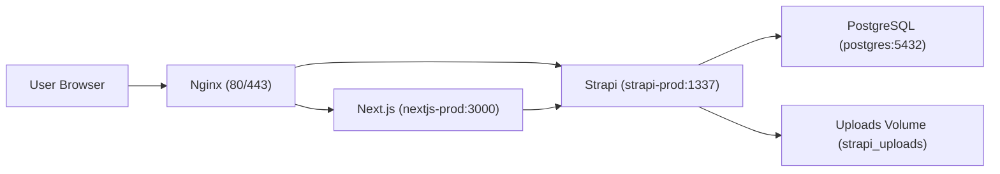

# FRJ CMS 架构文档

## 1. 系统架构图

## 2. 请求流向

1. 用户请求先到 Nginx。
2. 页面请求转发到 Next.js。
3. Next.js 需要内容时请求 Strapi。
4. Strapi 从 PostgreSQL 读取结构化数据。
5. 文件类资源由 Strapi + 上传卷提供。

## 3. Docker 关系

生产 Compose 服务：

- `postgres`
- `strapi-prod`
- `nextjs-prod`

依赖关系：

- `strapi-prod` 依赖 `postgres` 健康状态
- `nextjs-prod` 依赖 `strapi-prod` 健康状态

## 4. Nginx 反代

模板位于 `deploy/nginx/frj-cms.conf.example`：

- 站点域名 -> Next.js
- CMS 域名 -> Strapi

## 5. Strapi 职责

- 管理后台内容维护
- 暴露 REST API
- 管理上传资源
- 提供健康检查 `GET /api/health`

## 6. Next.js 职责

- 前台页面渲染
- 路由与 SEO
- 调用 Strapi API 聚合内容
- 提供健康检查 `GET /api/health`

## 7. PostgreSQL 职责

- 持久化 Strapi 内容数据
- 为 CMS 与前端读取提供一致数据源

## 8. 文件存储

- Strapi 上传目录映射到 `strapi_uploads` 卷
- 容器重建后文件仍保留

## 9. 网络结构

- 容器间通信走 `frj_network`
- 生产默认端口映射由 `.env.production` 控制
- 可按部署策略绑定 `127.0.0.1` 或 `0.0.0.0`

## 10. 生产环境架构

推荐模式：

- 公网仅暴露 Nginx（80/443）
- Next.js/Strapi/PostgreSQL 通过内网或本机回环访问
- 定期执行 `./scripts/backup.sh` 做数据库备份
