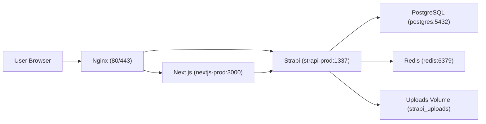

# FRJ CMS 架构文档（V0.2）

## 1. 系统架构图

## 2. 请求流向

1. 用户请求到 Nginx。
2. 页面请求转发到 Next.js。
3. Next.js 服务端通过 `STRAPI_URL` 访问 Strapi。
4. 询盘/埋点由浏览器先访问 Next 同源 API，再转发到 Strapi。
5. Strapi 读写 PostgreSQL，上传文件落盘到 volume。

## 3. Docker 服务与依赖

生产服务：

- `postgres`
- `redis`
- `strapi-prod`
- `nextjs-prod`

依赖关系：

- `strapi-prod` 依赖 `postgres` 健康
- `nextjs-prod` 依赖 `strapi-prod` 健康

## 4. 各组件职责

### Next.js

- 前台页面渲染
- i18n 路由与 SEO 元信息
- 同源代理接口（询盘/埋点）
- 健康检查：`GET /api/health`

### Strapi

- CMS 管理后台
- REST API（内容、询盘、统计）
- 询盘状态流转与落库
- 健康检查：`GET /api/health`

### PostgreSQL

- 结构化业务数据持久化

### Redis

- 预留缓存/队列基础设施（当前主要作为部署基线服务）

## 5. 网络与端口

- 容器内部网络：`frj_network`
- 对外端口由 `.env.production` 控制：`NEXT_PORT`、`STRAPI_PORT`、`POSTGRES_PORT`
- 推荐公网仅暴露 Nginx，数据库仅本机/内网访问

## 6. 运维基线

- 统一部署入口：`./scripts/deploy-prod.sh`
- 统一日志入口：`./scripts/logs.sh`
- 数据备份恢复：`./scripts/backup.sh` / `./scripts/restore.sh`
